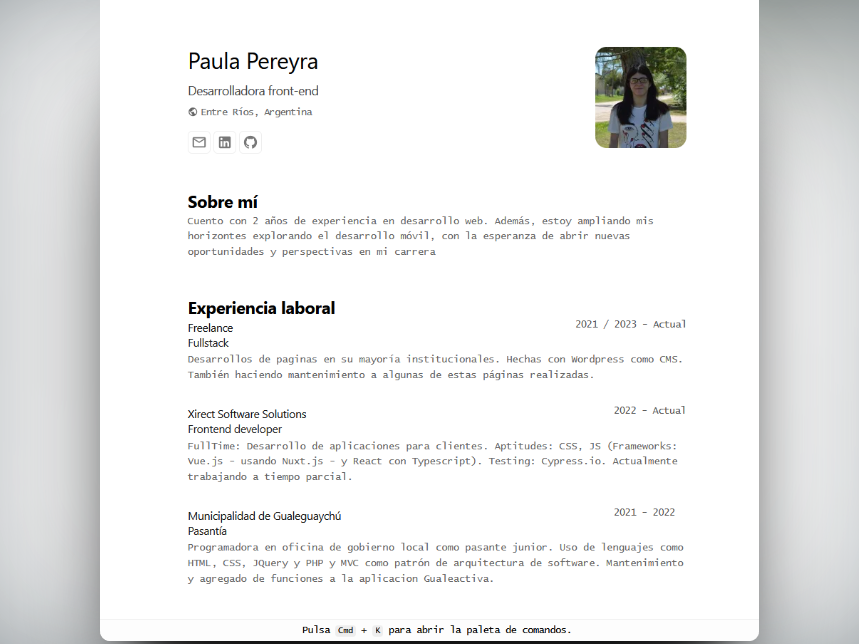

# Porfolio

Portfolio minimalista personal, hecho a partir del que hizo [midudev](https://github.com/midudev/minimalist-portfolio-json).

Quise hacerlo es que de esta manera, porque a este se puede tener actualizado solo actualizando el JSON (Esquema de <a href="https://jsonresume.org/schema/">jsonresume.org</a>).

